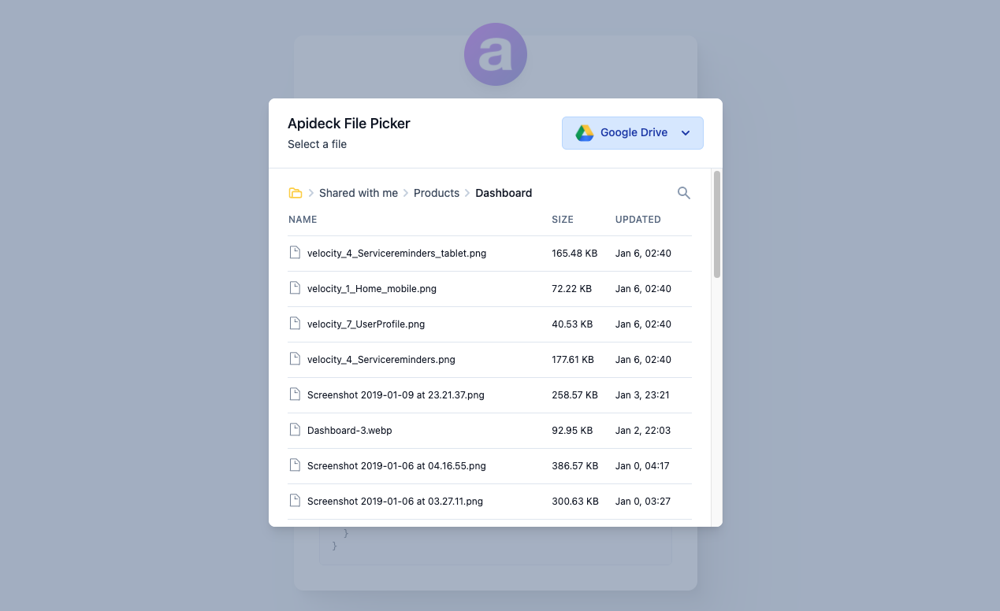

# Apideck File Picker Demo

A sample project showcasing the React File Picker component that works with the Apideck [File Storage API](https://developers.apideck.com/apis/file-storage/reference).

Sign up for a free account at [apideck.com](https://app.apideck.com/signup) to obtain an API key and App ID.

View the code and documentation of the File Picker component [here](https://github.com/apideck-libraries/file-picker).

## Getting started

Duplicate `.env.example` file, rename it to `.env` and replace the placeholders with your Apideck credentials.

Install the dependencies and run the local development server:

```
yarn && yarn dev
```



### Commands

#### `yarn dev`

Runs `next dev` which starts the app in development mode.<br>
Open [http://localhost:3000](http://localhost:3000) to view it in the browser.

#### `yarn build`

Runs `next build` which builds the application for production usage

#### `yarn start`

Runs `next start` which starts a Next.js production server

#### `yarn lint`

Runs the `eslint` command for all files with the `js`, `ts`, `jsx`, and `tsx` extensions. See the `.eslint.json` file for all configuration settings.

#### `yarn lint:fix`

Runs the `eslint` command with the `--fix` flag which tries to automatically fix linting problems.

#### `yarn lint:cache`

Runs the `eslint` command with the `--cache` flag which only checks the changed files.

#### `yarn lint:format`

Runs Prettier which formats all files inside the `src` directory based on the configuration set inside the `.prettierrc` file.

#### `yarn type-check`

Runs the `tsc` command to compile the project and check if it has type errors.

#### `yarn test`

Runs the `jest` command which runs all tests

#### `yarn test:watch`

Runs the `jest` command with `--watch` flag which runs all tests in watch mode

#### `yarn test:coverage`

Runs the `jest` command with `--coverage` flag which indicates that test coverage information should be collected and reported in the output.

## Commit hooks

This project uses [husky](https://github.com/typicode/husky) and [lint-staged](https://github.com/okonet/lint-staged) to run linters against staged git files on commit.

#### Pre-commit

Before each commit we run `eslint` and `prettier` on all staged files.

#### Pre-push

Before each push to the repository we run `jest` to check if all tests are passing.

## Resources

To learn more, take a look at the following resources:

- [File Storage API](https://developers.apideck.com/apis/file-storage/reference) - Apideck unified API reference
- [@apideck/file-picker](https://github.com/apideck-libraries/file-picker) - The React File Picker component
- [Next.js Documentation](https://nextjs.org/docs) - learn about Next.js features and API
- [Learn Next.js](https://nextjs.org/learn) - an interactive Next.js tutorial
- [TypeScript](https://www.typescriptlang.org/) - learn about TypeScript
- [Tailwind CSS](https://tailwindcss.com/) - learn about the utility-first CSS framework Tailwind
- [Jest](https://jestjs.io/) - learn about Jest, the JavaScript Testing Framework
- [React Testing Library](https://testing-library.com/docs/react-testing-library/intro/) - learn about testing React components with React Testing Library
- [ESLint](https://eslint.org/) - learn about analyzing code with ESLint
- [Prettier](https://eslint.org/) - learn about formatting code with Prettier
- [Prettier Extension](https://marketplace.visualstudio.com/items?itemName=esbenp.prettier-vscode) - a Prettier extension for Visual Studio Code
